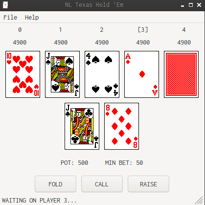
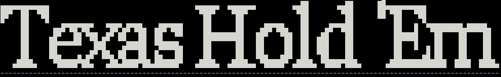

# holdem
A lightweight pure C texas hold 'em library. Cross-platform C++ GUI.



## Size
The goal for this is to optimize memory, currently the .so is 75Kb.
## Features
Complete Game Implementation <br />
Cactus Kev's Hand Evaulation <br />
Mersenne Twister RNG <br />
wxWidgets Cross-Platform C++ GUI <br />

## Installation
1. Clone repository
2. cd into ```gui/src/``` for GUI or ```/src/``` for Console/Library
3. run ```make``` and ```make clean```
## To-Do
Optimize data types <br />
Optimize 7-hand evaluator algorithm


